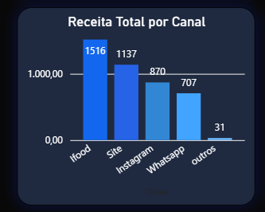
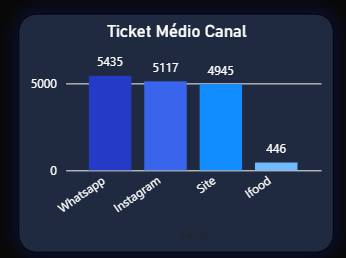

# 📊 Análise de Performance de Vendas de um E-commerce

Este projeto tem como objetivo analisar os dados de vendas de um e-commerce, utilizando uma abordagem completa de automação, tratamento, análise e visualização com **Python, SQL e Power BI**. A base de dados simula uma operação de vendas com múltiplos canais (Instagram, WhatsApp, Site, iFood), diversos status de pedidos e formas de pagamento.

---
## 🖼️ Visão Geral do Dashboard

Abaixo está uma prévia do painel final construído no Power BI com os principais KPIs e gráficos:


---

## ⚙️ Tecnologias Utilizadas

Python, SQL, Power BI...


## 🧠 Objetivo

Criar um projeto **realista e automatizado** que simula o dia a dia de um(a) Analista de Dados, passando por todas as etapas:

* 🚀 Automatizar o carregamento e limpeza de dados CSV com Python
* 🧹 Tratar dados inconsistentes ou incompletos
* 🧾 Enviar os dados para um banco MySQL
* 🔍 Realizar análises com SQL e Python (pandas)
* 📊 Criar dashboards interativos e profissionais com Power BI
* 📁 Organizar um repositório apresentável para o GitHub

---

## ⚙️ Estrutura do Projeto

```
📁 Analise_Ecommerce  
├── 📁 analise_python  
│   ├── 📄 analise_dados.ipynb  
│   ├── 📄 automacao.py  
│   ├── 📄 porcentagem_cancelados.csv  
│   ├── 📄 soma_total_canal.csv  
│   ├── 📄 ticket_medio_cliente.csv  
│   └── 📄 README.md  
│  
├── 📁 analise_sql   
│   ├── 📄 1_quantidade_pedidos_canal.sql  
│   ├── 📄 2_ticket_medio.sql  
│   └── 📄 3_porcentagem_entregues.sql  
│  
├── 📁 dashboard_powerbi  
│   └── 📄 dashboard.pbix  
│  
├── 📄 dados2.limpos.csv  
├── 📄 dados2.limpos.limpos.csv  
├── 📄 README.md  
|── 📄 explicacoes.md
|
├── 📁 img
|    ├── python_receita_canal.png
|    ├── segmentacao.png
|    ├── sql_ticket_medio.png


```

---

## ⚡ Automação com Python

Foi criado um script em Python que automatiza a leitura do **último arquivo CSV** adicionado à pasta do projeto. O processo inclui:

1. **Leitura automatizada** do arquivo mais recente com extensão `.csv`
2. **Limpeza genérica dos dados**, incluindo:

   * Remoção de espaços e caracteres indesejados
   * Padronização de campos como `status`, `canal`, `forma_pagamento`
   * Conversão de valores inconsistentes como `NAO INFORMADO` e `null` para padronização
3. **Criação da tabela limpa** diretamente no banco de dados MySQL (`limpeza.dados_limpos`)

Isso facilita futuras análises: basta adicionar um novo arquivo e executar o script.

---

## 🔍 Análises com SQL

As análises no SQL foram feitas diretamente no banco de dados MySQL após a automação. As queries utilizadas estão na pasta `Analise SQL`.

**Principais Métricas analisadas:**

* 📊 Porcentagem de pedidos entregues
* 📦 Quantidade de pedidos por canal
* 💰 Ticket médio por canal (receita / pedidos)

**Exemplo de gráfico:**



---

## 🐍 Análises com Python

Usando `pandas`, foram feitas análises mais detalhadas em um notebook `.ipynb`. Cada etapa do código foi comentada, explicando a lógica de forma didática.

**Métricas Python:**

1. **Porcentagem de pedidos cancelados**
2. **Ticket médio por cliente**
3. **Receita total por canal (validação cruzada)**

📎 *Todas essas análises são feitas com base no arquivo `dados2.limpos.csv` gerado pela automação.*

**Exemplo de código comentado:**

```python
# Agrupando os pedidos por cliente e calculando o ticket médio individual
ticket_por_cliente = df.groupby("Cliente")["Valor"].mean().round(2)
```
## 📊 Dashboard Power BI

O Power BI foi usado para criar visualizações **profissionais, modernas e interativas** com foco na performance de vendas do e-commerce.

---

### 📈 Gráficos e KPIs incluídos:

- 💰 Receita total por canal de venda  
- 💳 Ticket médio por canal  
- 📉 Quantidade de pedidos por canal  
- 🚫 Porcentagem de cancelamentos  
- ✅ Porcentagem de pedidos entregues  
- 🥧 Receita por forma de pagamento  
- 📆 Receita mensal  
- 🎯 Segmentações por status, canal e forma de pagamento

---
### 🖼️ Alguns exemplos:




> ⚙️ *O layout visual foi inspirado em dashboards corporativos, com foco em contraste, clareza e organização de KPIs.*

---
## 💡 Destaques do Projeto

* ✅ Fluxo completo de dados: do CSV até o Power BI
* 🧼 Tratamento de dados automatizado (sem dependência manual)
* 🧠 Análises com lógica de negócio
* 👩‍💻 Projeto realista, com uso de ferramentas amplamente usadas no mercado
* ✨ Comentários explicativos no código para facilitar o entendimento
* 💼 Ideal para portfólio de vaga em Análise ou Engenharia de Dados

---

## 🚀 Como Usar

1. Adicione um novo arquivo CSV com a estrutura original na pasta raiz
2. Execute o script `automacao_limpeza_envio.py`
3. Os dados limpos serão inseridos automaticamente no banco MySQL
4. Conecte seu Power BI ao banco e clique em "Atualizar"


## 🧾 Conclusão

Esse projeto simula um pipeline completo de análise de dados no e-commerce, com foco em **automação, visualização clara e insights de negócio**. Foi idealizado para demonstrar domínio técnico e visão analítica, sendo para entrevistas, portfólio ou GitHub.

---
## 👩‍💻 Sobre Mim

Olá! Me chamo Nicoly Cardoso dos Santos Rocha, estudante de Análise e Desenvolvimento de Sistemas e Marketing. Tenho me dedicado á área de Dados, desenvolvendo projetos completos com Python, SQL e Power BI — focando em automações, análises e dashboards interativos.  
Tenho interesse especial em Dados e busco oportunidades para aplicar meus conhecimentos na prática.

📬 E-mail: nicoly.cardoso450@gmail.com  
🔗 [LinkedIn] (https://www.linkedin.com/in/nicoly-cardoso-97135b244)
💻 [GitHub] (https://github.com/Nicoly450)

📘 Veja explicações técnicas detalhadas:  
[🔍 explicações.md](./explicacoes.md)

Projeto feito com 💡 dedicação, organização e propósito. Obrigada por acompanhar minha jornada!
